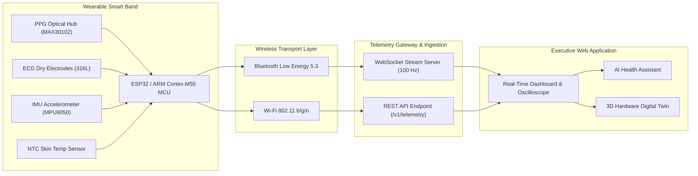

# Smart Healthcare Monitoring System (Wearable Smart Band)

An enterprise-grade, edge-AI powered **Smart Healthcare & Continuous Biometric Monitoring Platform** paired with a wearable **Smart Band (ARM Cortex-M55 / ESP32 MCU)**. The system captures high-frequency physiological telemetry, performs on-device neural classification, and visualizes live health metrics, sleep architecture, ECG conduction, and an interactive **3D Digital Twin**.

---

## Table of Contents

- [Project Overview](#project-overview)
- [Key Features](#key-features)
- [System Architecture](#system-architecture)
- [Hardware & Sensors Used](#hardwaresensors-used)
- [Technology Stack](#technology-stack)
- [Real-Time Data Flow](#real-time-data-flow)
- [Digital Twin Feature](#digital-twin-feature)
- [Frontend Pages](#frontend-pages)
- [Installation & Setup](#installation--setup)
- [How to Run Frontend and Backend](#how-to-run-frontend-and-backend)
- [How Real Sensor Data Connects to the Dashboard](#how-real-sensor-data-connects-to-the-dashboard)
- [Environment Variables](#environment-variables)
- [Project Folder Structure](#project-folder-structure)
- [Future Enhancements](#future-enhancements)
- [Disclaimer](#disclaimer)

---

## Project Overview

The **Smart Healthcare Monitoring System** is designed for high-resolution personal health surveillance and remote wellness tracking. By pairing wearable sensor nodes with edge microcontrollers and a responsive cloud dashboard, the platform provides continuous visibility into vital signs, cardiac rhythms, and physical strain with sub-second latency.

```
Smart Band Sensors → ESP32 / ARM MCU → Wi-Fi / BLE → Backend API / WebSocket → Real-Time Dashboard → Digital Twin
```

---

## Key Features

- **Live Biometric Telemetry**: Real-time streaming of **Heart Rate (BPM)**, **Blood Oxygen ($\text{SpO}_2$)**, **Body/Skin Temperature (°C)**, and **Blood Pressure (mmHg)** via Pulse Transit Time (PTT).
- **Single-Lead 250 Hz ECG Monitor**: High-fidelity cardiac waveform oscilloscope, interactive **Electronic Calipers** ($R\text{-}R$, $P\text{-}R$, $\text{QRS}$, $\text{QT/QTc}$ intervals), and frequency-domain HRV power spectral density (PSD).
- **Sleep Architecture & Hypnogram**: 4-stage sleep breakdown (Deep N3, REM, Light N1/N2, Awake) with nocturnal autonomic heart-rate dipping analysis.
- **Kinetic Activity & Energy Burn**: Step cadence, active metabolic calorie expenditure, standing hours, and aerobic target zones.
- **Conversational AI Health Assistant**: Context-aware natural language companion powered by quantized on-device neural models for physiological recommendations.
- **Interactive 3D Digital Twin**: Live hardware mirror showing device state, battery percentage, BLE RSSI, thermal status, CPU load, and sensor teardown diagnostics.
- **Clinical Dossiers & Interoperable Exports**: Multi-template reporting engine with direct export to **Print/PDF**, raw **CSV datasets**, and **FHIR R4 Diagnostic JSON** bundles with LOINC and CPT codes.
- **Multi-Level Alert Auditing**: Threshold-based biometric violation detection with timestamped telemetry audit trails.

---

## System Architecture



---

## Hardware/Sensors Used

| Sensor / Component                    | Model / Specs                                                           | Physiological Parameter Measured                                 |
| :------------------------------------ | :---------------------------------------------------------------------- | :--------------------------------------------------------------- |
| **Bio-Optical PPG Sensor Hub**        | MAX30102 / Dual-Wavelength (525nm Green / 660nm Red / 940nm IR)         | Heart Rate (BPM), Blood Oxygen ($\text{SpO}_2$), Perfusion Index |
| **Single-Lead ECG Electrodes**        | 316L Stainless Steel Dry Electrodes (24-bit $\Sigma\text{-}\Delta$ ADC) | Cardiac Electrical Depolarization, Arrhythmia Detection, HRV     |
| **3-Axis Inertial Motion Unit (IMU)** | MPU6050 / Accelerometer + Gyroscope                                     | Step Count, Kinetic Velocity, Spatial Posture, Fall Shock        |
| **Contact Temperature Probe**         | High-Precision NTC Thermistor ($\pm0.05^\circ\text{C}$ accuracy)        | Dermal Temperature Equilibrium                                   |
| **Microcontroller (MCU)**             | ESP32-WROOM-32 / ARM Cortex-M55 (160 MHz, Helium Vector DSP)            | Edge Signal Processing, Filter DSP, CMSIS-NN Quantized Inference |
| **Wireless Transceiver**              | Integrated Dual-Mode Wi-Fi 2.4 GHz + BLE 5.3                            | Low-Latency Telemetry Transmission                               |
| **Display & Battery**                 | 1.47" AMOLED Touch Display + 220 mAh Li-Po Battery                      | On-Band Visual Feedback, 7-Day Battery Autonomy                  |

---

## Technology Stack

- **Core Framework**: [React 19](https://react.dev/) + [TypeScript 5.8](https://www.typescriptlang.org/)
- **Routing & SSR**: [TanStack Start](https://tanstack.com/start) + [TanStack Router](https://tanstack.com/router)
- **Data Fetching & State**: [TanStack Query v5](https://tanstack.com/query)
- **Styling**: [Tailwind CSS v4](https://tailwindcss.com/) + Vanilla CSS design tokens
- **Component Primitives**: [Radix UI](https://www.radix-ui.com/)
- **Data Visualization**: [Recharts](https://recharts.org/) + HTML5 Canvas 250 Hz Oscilloscope
- **3D Graphics**: [Three.js](https://threejs.org/) for Digital Twin hardware rendering
- **Icons & UI Feedback**: [Lucide React](https://lucide.dev/) + [Sonner Toasts](https://sonner.emilkowal.ski/)
- **Build Tooling & Server Engine**: [Vite 8](https://vitejs.dev/) + [Nitro](https://nitro.unjs.io/)

---

## Real-Time Data Flow

1. **Analog Acquisition**: Bio-sensors sample continuous optical PPG (100 Hz), single-lead ECG (250 Hz), and 3-axis motion (50 Hz).
2. **On-Chip Signal Conditioning**: The MCU applies high-pass baseline wander removal (0.5 Hz), 50/60 Hz notch filtering, and running window peak detection.
3. **Quantized Edge Inference**: Local INT8 neural networks evaluate rhythm regularity and motion metrics in 1.2 ms per window.
4. **Packet Serialization**: Telemetry frames are packed into JSON/CBOR structures and transmitted via WebSocket or BLE GATT characteristics.
5. **Client Deserialization**: The web application ingests incoming frames via `useSimulation()` or native WebSocket listeners, updating reactive state and canvas sweep buffers.
6. **3D Twin Sync**: The hardware digital twin updates spatial rotation, thermal hotspots, and battery state simultaneously.

---

## Digital Twin Feature

The **Smart Band Digital Twin** (`/devices`) provides a real-time hardware mirror of the physical wearable:

- **Interactive 3D Render**: Full 360-degree rotation and inspection using Three.js and dynamic canvas shading.
- **Hardware Hotspot Diagnostics**:
  - `1.47" AMOLED Display`: Status, refresh rate, and display brightness.
  - `Bio-Optical PPG Hub`: LED emitter currents and optical perfusion levels.
  - `ARM Cortex-M55 Core`: CPU utilization, SRAM allocation, and neural latency.
  - `316L ECG Electrodes`: Skin contact impedance ($4.2\text{ k}\Omega$).
  - `Li-Po Battery Management`: Voltage ($3.84\text{ V}$), discharge rate, and remaining runtime.
- **Teardown & Multi-Angle Modes**: Switch between Front Enclosure, Sensor Array Backplate, and Internal PCB Teardown views.

---

## Frontend Pages

| Route Path      | Page Name              | Primary Functionality                                                                                                                       |
| :-------------- | :--------------------- | :------------------------------------------------------------------------------------------------------------------------------------------ |
| `/dashboard`    | **Health Cockpit**     | Primary executive overview, 4 core vitals 2x2 grid, Health Readiness Score, and telemetry waveform trend analyzer.                          |
| `/live`         | **Live Vitals**        | 100 Hz continuous optical PPG waveform stream, pulse pressure, mean arterial pressure (MAP), and perfusion index.                           |
| `/ecg`          | **ECG Monitor**        | 250 Hz single-lead oscilloscope, electronic calipers ($R\text{-}R, P\text{-}R, \text{QRS}, \text{QTc}$), and frequency-domain HRV spectrum. |
| `/activity`     | **Activity & Energy**  | Kinetic step cadence, active kcal burn, hourly stand breakdown, and aerobic intensity heart rate zones.                                     |
| `/sleep`        | **Sleep Architecture** | 4-stage hypnogram visualization (Deep N3, REM, Light, Awake), sleep efficiency score, and nocturnal dip metrics.                            |
| `/ai-assistant` | **AI Assistant**       | Dedicated conversational health intelligence suite for analyzing vitals, workouts, and medical consultation summaries.                      |
| `/trends`       | **Health History**     | Longitudinal 30-day vitals trends, diurnal day/night distribution, and cardiovascular stability graphs.                                     |
| `/alerts`       | **Alerts & Audit**     | Physiological anomaly alerts, severity classification (Critical, Warning, Info), and resolution audit trail.                                |
| `/devices`      | **Smart Band**         | Live device telemetry, firmware status, battery level, and interactive 3D Hardware Digital Twin.                                            |
| `/reports`      | **Reports & Dossiers** | Clinical dossier generator with interactive 7-day progression chart, ASCVD risk scores, and PDF / CSV / FHIR JSON export.                   |
| `/settings`     | **Settings**           | User profile configuration, threshold alarms, edge AI inference modes, and hardware sync options.                                           |

---

## Installation & Setup

### Prerequisites

- **Node.js**: v20.x or later
- **npm** (v10+), **pnpm**, or **yarn**

### 1. Clone Repository

```bash
git clone https://github.com/madhesh935/ARM.git
cd ARM
```

### 2. Install Dependencies

```bash
npm install
```

---

## How to Run Frontend and Backend

### Development Mode

Starts the Vite development server with hot module replacement (HMR):

```bash
npm run dev
```

Open your browser at **`http://localhost:8080`** (or the port specified in terminal output).

### Code Quality & Linting

```bash
# Check code style and lint errors
npm run lint

# Auto-format all code with Prettier
npm run format
```

### Production Build & Preview

```bash
# Compile client and server bundles
npm run build

# Preview production build locally
npm run preview
```

---

## How Real Sensor Data Connects to the Dashboard

The dashboard supports both **standalone mock simulation** (for offline demonstration) and **live IoT hardware telemetry streaming** via WebSocket or HTTP REST.

### 1. Telemetry JSON Payload Specification

Send JSON packets matching this structure from your ESP32 / backend gateway:

```json
{
  "timestamp": "2026-08-17T20:00:00.000Z",
  "deviceId": "SB-01-PRO",
  "patientId": "USR-00124",
  "heartRate": 76,
  "spo2": 98.2,
  "temperature": 36.8,
  "systolic": 118,
  "diastolic": 76,
  "steps": 6824,
  "calories": 1840,
  "stress": 24,
  "battery": 84,
  "signalQuality": "Excellent",
  "ppgWaveform": [0.42, 0.48, 0.65, 0.92, 0.74, 0.51, 0.43],
  "ecgWaveform": [0.01, 0.05, -0.08, 0.85, -0.32, 0.12, 0.02]
}
```

### 2. ESP32 Arduino C++ Code Example

```cpp
#include <WiFi.h>
#include <HTTPClient.h>
#include <ArduinoJson.h>

const char* ssid = "YOUR_WIFI_SSID";
const char* password = "YOUR_WIFI_PASSWORD";
const char* serverUrl = "http://YOUR_SERVER_IP:8080/api/telemetry";

void setup() {
  Serial.begin(115200);
  WiFi.begin(ssid, password);
  while (WiFi.status() != WL_CONNECTED) { delay(500); }
}

void loop() {
  if (WiFi.status() == WL_CONNECTED) {
    HTTPClient http;
    http.begin(serverUrl);
    http.addHeader("Content-Type", "application/json");

    StaticJsonDocument<256> doc;
    doc["deviceId"] = "SB-01-PRO";
    doc["heartRate"] = 76;
    doc["spo2"] = 98.2;
    doc["temperature"] = 36.8;
    doc["systolic"] = 118;
    doc["diastolic"] = 76;

    String requestBody;
    serializeJson(doc, requestBody);
    int httpResponseCode = http.POST(requestBody);
    http.end();
  }
  delay(1000); // 1 Hz vitals transmission
}
```

---

## Environment Variables

Create a `.env` file in the project root directory to configure telemetry ingestion endpoints:

```env
# Toggle between synthetic simulation and real backend ingestion (true | false)
VITE_USE_MOCK_DATA=true

# REST API Base Endpoint for Patient & Device Telemetry
VITE_API_URL=https://api.smarthealth-telemetry.io/v1

# WebSocket Gateway URL for 100 Hz Live Waveform Stream
VITE_WS_URL=wss://stream.smarthealth-telemetry.io/live
```

---

## Project Folder Structure

```
edge-health-monitor/
├── src/
│   ├── components/
│   │   ├── ai/               # AI Assistant drawer & conversational components
│   │   ├── charts/           # Waveform and longitudinal trend chart visualizers
│   │   ├── common/           # Reusable badges, metric cards, status indicators
│   │   ├── dashboard/        # Cockpit cards, wellness meters, vitals grids
│   │   ├── devices/          # 3D Digital Twin hardware renderer
│   │   ├── layout/           # AppShell global header, persistent sidebar, navigation
│   │   └── ui/               # Radix UI design system primitives
│   ├── hooks/
│   │   ├── useAlerts.ts      # Active alert state management
│   │   ├── useAuth.tsx       # User authentication context
│   │   └── useSimulation.tsx # Real-time 1 Hz / 100 Hz / 250 Hz telemetry stream generator
│   ├── lib/
│   │   ├── analysis.ts       # Digital signal processing, decimation, waveform filters
│   │   └── utils.ts          # Styling & formatting utilities
│   ├── mock/
│   │   └── data.ts           # Hardware specs, patient records, initial telemetry baselines
│   ├── routes/               # File-based TanStack Start route pages
│   │   ├── __root.tsx        # Application root layout with font definitions
│   │   ├── dashboard.tsx     # Executive Health Cockpit
│   │   ├── live.tsx          # Live Biometrics & Optical PPG Waveform Stream
│   │   ├── ecg.tsx           # 250 Hz Single-Lead ECG & Electronic Caliper Suite
│   │   ├── activity.tsx      # Kinetic Steps, Distance, Caloric Burn
│   │   ├── sleep.tsx         # Sleep Architecture & Hypnogram Analysis
│   │   ├── ai-assistant.tsx  # Full-Screen Conversational AI Assistant
│   │   ├── trends.tsx        # 30-Day Longitudinal Vitals Analytics
│   │   ├── alerts/           # Alert Notifications & Resolution Logs
│   │   ├── devices.tsx       # Smart Band 3D Digital Twin & Device Telemetry
│   │   ├── reports.tsx       # Clinical Health Dossier & FHIR / CSV Export Engine
│   │   └── settings.tsx      # User Profile, Thresholds & Calibration Controls
│   ├── services/             # REST & WebSocket API communication adapters
│   ├── styles.css            # Global CSS tokens, Tailwind v4 imports, typography rules
│   └── types/                # Strict TypeScript interfaces for vitals, devices, alerts
├── package.json              # Project scripts and dependency declarations
├── vite.config.ts            # Vite compiler & TanStack router plugin configuration
└── README.md                 # Complete project technical documentation
```

---

## Future Enhancements

- **Multi-Lead ECG Reconstruction**: Algorithmic derivation of 6-lead / 12-lead vectors from single-lead differential inputs.
- **Continuous Glucose Monitor (CGM) BLE Ingestion**: Integration of interstitial glucose sensor streams over Bluetooth Low Energy.
- **Federated Edge Learning**: Privacy-preserving on-device neural weight training without raw biometric cloud egress.
- **Voice Biometrics**: Voice-activated emergency check-ins and query synthesis for the AI Health Assistant.

---

## Disclaimer

This platform and its associated smart band hardware are intended for **investigational, fitness, and wellness monitoring purposes only**. It is not a certified diagnostic medical device. Users should always seek the advice of a qualified physician or healthcare professional for clinical diagnoses and treatment decisions.
