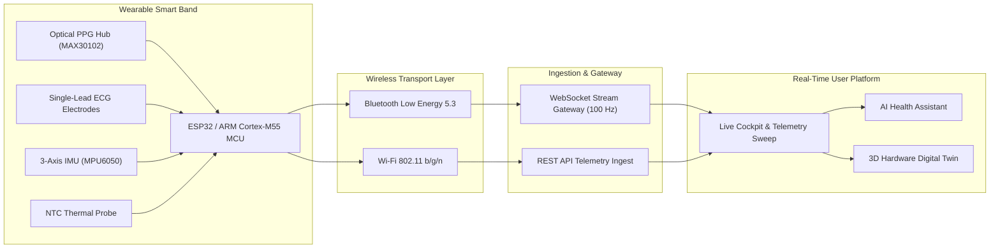

# Smart Healthcare Monitoring System (Wearable Smart Band)

An enterprise-grade, edge-AI powered **Smart Healthcare & Continuous Biometric Monitoring Platform** paired with an advanced wearable **Smart Band (ARM Cortex-M55 / ESP32 MCU)**. The system continuously captures high-frequency physiological vitals, performs on-device neural inference, and delivers real-time biometrics, sleep architecture, cardiac waveforms, and an interactive **3D Digital Twin**.

---

## Table of Contents

- [Project Overview](#project-overview)
- [Key Features](#key-features)
- [System Architecture](#system-architecture)
- [Hardware & Sensors](#hardware--sensors)
- [Technology Stack](#technology-stack)
- [Real-Time Telemetry Flow](#real-time-telemetry-flow)
- [3D Digital Twin](#3d-digital-twin)
- [Application Pages](#application-pages)
- [Installation & Setup](#installation--setup)
- [Running the Application](#running-the-application)
- [Connecting Wearable Sensors to the Dashboard](#connecting-wearable-sensors-to-the-dashboard)
- [Environment Configuration](#environment-configuration)
- [Project Structure](#project-structure)
- [Future Roadmap](#future-roadmap)
- [Disclaimer](#disclaimer)

---

## Project Overview

The **Smart Healthcare Monitoring System** delivers end-to-end continuous health tracking and physiological telemetry. Operating at the intersection of embedded microcontrollers, edge artificial intelligence, and modern web technologies, the platform streams live vital signs from wearable sensors directly into an executive dashboard with sub-second response times.

```
Smart Band Sensors → ESP32 / ARM MCU → Wi-Fi / BLE 5.3 → Backend API / WebSocket → Real-Time Dashboard → Digital Twin
```

---

## Key Features

- **Live Biometric Telemetry**: Real-time continuous streaming of **Heart Rate (BPM)**, **Blood Oxygen ($\text{SpO}_2$)**, **Skin Temperature (°C)**, and **Blood Pressure (mmHg)** via Pulse Transit Time (PTT).
- **Single-Lead 250 Hz ECG Oscilloscope**: High-resolution continuous cardiac sweep with interactive **Electronic Calipers** ($R\text{-}R$, $P\text{-}R$, $\text{QRS}$, $\text{QT/QTc}$ intervals) and frequency-domain HRV power spectral density.
- **Sleep Architecture & Hypnogram**: 4-stage sleep breakdown (Deep Slow-Wave N3, REM Dream, Light N1/N2, Awake) with nocturnal autonomic heart-rate dipping analysis.
- **Kinetic Activity & Caloric Expenditure**: Step cadence tracking, active metabolic burn (kcal), walking distance, and aerobic heart rate training zones.
- **Conversational AI Health Assistant**: Intelligent natural language assistant powered by quantized on-device neural models, providing context-aware health insights based on continuous wearable telemetry.
- **Interactive 3D Digital Twin**: Real-time 3D hardware mirror showing device orientation, battery percentage, thermal status, CPU load, and sensor teardown diagnostics.
- **Personal Health Summaries & Export**: Longitudinal 7-day progress reports, habit milestone tracking, and one-click **Print / PDF**, **CSV Dataset**, and **Share Link** exports.
- **Multi-Level Biometric Alerting**: Instant notification for physiological threshold excursions with a permanent audit history.

---

## System Architecture



---

## Hardware & Sensors

| Sensor / Component                    | Hardware Specification                                         | Measured Telemetry                                                      |
| :------------------------------------ | :------------------------------------------------------------- | :---------------------------------------------------------------------- |
| **Bio-Optical PPG Sensor**            | MAX30102 (Dual 525nm Green / 660nm Red / 940nm IR LEDs)        | Heart Rate (BPM), Blood Oxygen ($\text{SpO}_2$), Perfusion Index        |
| **Dry Contact ECG Electrodes**        | 316L Stainless Steel (24-bit $\Sigma\text{-}\Delta$ ADC)       | Cardiac Electrical Conduction (250 Hz), Arrhythmia Detection, HRV       |
| **3-Axis Inertial Motion Unit (IMU)** | MPU6050 Accelerometer + Gyroscope                              | Step Count, Kinetic Velocity, Spatial Posture, Fall Shock               |
| **Thermal Sensor**                    | High-Precision NTC Dermal Thermistor ($\pm0.05^\circ\text{C}$) | Dermal Equilibrium Temperature                                          |
| **Microcontroller (MCU)**             | ESP32-WROOM-32 / ARM Cortex-M55 (160 MHz, Helium Vector DSP)   | Edge Signal Conditioning, Digital Filters, CMSIS-NN Quantized Inference |
| **Wireless Transceiver**              | Integrated Dual-Band Wi-Fi + BLE 5.3                           | Low-Latency Telemetry Transmission                                      |
| **Display & Battery**                 | 1.47" AMOLED Touch Screen + 220 mAh Li-Po Battery              | On-Device Visual Feedback, 7-Day Continuous Battery Autonomy            |

---

## Technology Stack

- **Frontend Core**: [React 19](https://react.dev/) + [TypeScript 5.8](https://www.typescriptlang.org/)
- **Routing & SSR Architecture**: [TanStack Start](https://tanstack.com/start) + [TanStack Router](https://tanstack.com/router)
- **State & Data Ingestion**: [TanStack Query v5](https://tanstack.com/query)
- **Styling**: [Tailwind CSS v4](https://tailwindcss.com/) + Custom CSS Design System
- **UI Components**: [Radix UI Primitives](https://www.radix-ui.com/)
- **Telemetry Visualizations**: [Recharts](https://recharts.org/) + High-Frequency HTML5 Canvas Sweep
- **3D Graphics Engine**: [Three.js](https://threejs.org/) for Digital Twin rendering
- **Icons & Feedback**: [Lucide React](https://lucide.dev/) + [Sonner Notifications](https://sonner.emilkowal.ski/)
- **Build Tooling & Server Engine**: [Vite 8](https://vitejs.dev/) + [Nitro SSR](https://nitro.unjs.io/)

---

## Real-Time Telemetry Flow

1. **Continuous Acquisition**: Bio-sensors sample optical PPG ($100\text{ Hz}$), single-lead ECG ($250\text{ Hz}$), and kinetic acceleration ($50\text{ Hz}$).
2. **On-Chip Signal Processing**: The MCU applies high-pass baseline wander removal ($0.5\text{ Hz}$), $50/60\text{ Hz}$ notch filtering, and running window peak detection.
3. **Quantized Edge Inference**: Local INT8 neural networks classify rhythm regularity and kinetic state in $1.2\text{ ms}$ per sample window.
4. **Packet Serialization**: Telemetry frames are serialized into JSON/binary structures and transmitted via WebSocket or BLE GATT characteristics.
5. **Client Stream Ingestion**: The web platform receives incoming packets, updating reactive state and rendering live canvas oscilloscope sweeps.
6. **3D Twin Synchronization**: The 3D Digital Twin mirrors orientation, thermal hotspots, and battery state simultaneously.

---

## 3D Digital Twin

The **Smart Band Digital Twin** (`/devices`) provides a real-time hardware mirror of the physical wearable:

- **Interactive 3D Render**: Full 360-degree rotation and inspection using Three.js.
- **Hardware Hotspot Diagnostics**:
  - `1.47" AMOLED Display`: Refresh rate, active pixels, and peak brightness.
  - `Bio-Optical PPG Hub`: LED emitter currents and optical perfusion levels ($4.8\%$).
  - `ARM Cortex-M55 / ESP32 Core`: CPU utilization, SRAM allocation, and inference latency.
  - `316L ECG Electrodes`: Skin contact impedance ($4.2\text{ k}\Omega$).
  - `Li-Po Battery Management`: Voltage ($3.84\text{ V}$), discharge rate, and remaining runtime.
- **Multi-Angle Modes**: Switch between Enclosure, Sensor Array Backplate, and Internal Hardware views.

---

## Application Pages

| Route Path      | Page Name              | Core Functionality                                                                                                                       |
| :-------------- | :--------------------- | :--------------------------------------------------------------------------------------------------------------------------------------- |
| `/dashboard`    | **Health Cockpit**     | Primary executive overview, 4 core vitals 2x2 grid, Body Readiness Score, and live telemetry trends.                                     |
| `/live`         | **Live Vitals**        | 100 Hz continuous optical PPG waveform stream, pulse pressure, mean arterial pressure (MAP), and perfusion index.                        |
| `/ecg`          | **ECG Monitor**        | 250 Hz single-lead cardiac oscilloscope, electronic calipers ($R\text{-}R, P\text{-}R, \text{QRS}, \text{QTc}$), and HRV power spectrum. |
| `/activity`     | **Activity & Energy**  | Kinetic step volume, active calorie burn, hourly standing breakdown, and aerobic heart rate zones.                                       |
| `/sleep`        | **Sleep Architecture** | 4-stage hypnogram visualization (Deep N3, REM, Light, Awake), sleep efficiency score, and nocturnal dip metrics.                         |
| `/ai-assistant` | **AI Assistant**       | Full-screen conversational AI health coach for analyzing workouts, vitals trends, and personalized recommendations.                      |
| `/trends`       | **Health History**     | Longitudinal 30-day vitals trends, diurnal day/night distributions, and cardiovascular stability graphs.                                 |
| `/alerts`       | **Alerts & Audit**     | Physiological anomaly alerts, severity classification (Critical, Warning, Info), and resolution audit logs.                              |
| `/devices`      | **Smart Band**         | Live device telemetry, battery status, firmware details, and interactive 3D Hardware Digital Twin.                                       |
| `/reports`      | **Personal Reports**   | Comprehensive 7-day health summaries, habit milestone tracking, and one-click PDF / CSV export.                                          |
| `/settings`     | **Settings**           | User profile configuration, threshold alarms, edge AI inference modes, and hardware sync options.                                        |

---

## Installation & Setup

### Prerequisites

- **Node.js**: v20.x or later
- **npm** (v10+), **pnpm**, or **yarn**

### 1. Clone Repository

```bash
git clone https://github.com/madhesh935/ARM.git
cd ARM
```

### 2. Install Dependencies

```bash
npm install
```

---

## Running the Application

### Development Server

Starts Vite with hot module replacement (HMR):

```bash
npm run dev
```

Open your browser at **`http://localhost:8080`**.

### Code Quality & Linting

```bash
# Run ESLint validation
npm run lint

# Auto-format codebase with Prettier
npm run format
```

### Production Build & Preview

```bash
# Compile client and server SSR bundles
npm run build

# Preview production build locally
npm run preview
```

---

## Connecting Wearable Sensors to the Dashboard

The platform ingests live sensor telemetry via standard WebSocket or HTTP REST endpoints.

### 1. Telemetry JSON Payload Schema

Send JSON packets matching this structure from your microcontroller or gateway:

```json
{
  "timestamp": "2026-08-19T20:00:00.000Z",
  "deviceId": "SB-01-PRO",
  "userId": "USR-00124",
  "heartRate": 76,
  "spo2": 98.2,
  "temperature": 36.8,
  "systolic": 118,
  "diastolic": 76,
  "steps": 6824,
  "calories": 1840,
  "battery": 84,
  "signalQuality": "Excellent",
  "ppgWaveform": [0.42, 0.48, 0.65, 0.92, 0.74, 0.51, 0.43],
  "ecgWaveform": [0.01, 0.05, -0.08, 0.85, -0.32, 0.12, 0.02]
}
```

### 2. ESP32 Arduino C++ Code Example

```cpp
#include <WiFi.h>
#include <HTTPClient.h>
#include <ArduinoJson.h>

const char* ssid = "YOUR_WIFI_SSID";
const char* password = "YOUR_WIFI_PASSWORD";
const char* serverUrl = "http://YOUR_SERVER_IP:8080/api/telemetry";

void setup() {
  Serial.begin(115200);
  WiFi.begin(ssid, password);
  while (WiFi.status() != WL_CONNECTED) { delay(500); }
}

void loop() {
  if (WiFi.status() == WL_CONNECTED) {
    HTTPClient http;
    http.begin(serverUrl);
    http.addHeader("Content-Type", "application/json");

    StaticJsonDocument<256> doc;
    doc["deviceId"] = "SB-01-PRO";
    doc["heartRate"] = 76;
    doc["spo2"] = 98.2;
    doc["temperature"] = 36.8;
    doc["systolic"] = 118;
    doc["diastolic"] = 76;

    String requestBody;
    serializeJson(doc, requestBody);
    int httpResponseCode = http.POST(requestBody);
    http.end();
  }
  delay(1000); // 1 Hz vitals transmission
}
```

---

## Environment Configuration

Create a `.env` file in the root directory to customize server endpoints:

```env
# REST API Base Endpoint for Telemetry Ingestion
VITE_API_URL=https://api.smarthealth-telemetry.io/v1

# WebSocket Gateway URL for Live High-Frequency Waveform Stream
VITE_WS_URL=wss://stream.smarthealth-telemetry.io/live
```

---

## Project Structure

```
edge-health-monitor/
├── src/
│   ├── components/
│   │   ├── ai/               # AI Assistant interface and conversational chat
│   │   ├── charts/           # Waveform and longitudinal chart visualizers
│   │   ├── common/           # Reusable metric cards, status indicators, badges
│   │   ├── dashboard/        # Health cockpit cards, readiness meters, vitals grids
│   │   ├── devices/          # 3D Digital Twin hardware renderer (Three.js)
│   │   ├── layout/           # AppShell global header, persistent sidebar, navigation
│   │   └── ui/               # Radix UI design system primitives
│   ├── hooks/
│   │   ├── useAlerts.ts      # Active alert state management
│   │   ├── useAuth.tsx       # User authentication context
│   │   └── useSimulation.tsx # Telemetry streaming and signal processing hook
│   ├── lib/
│   │   ├── analysis.ts       # Signal processing, decimation, and waveform filtering
│   │   └── utils.ts          # Styling & formatting utilities
│   ├── routes/               # File-based TanStack Start route pages
│   │   ├── __root.tsx        # Application root shell
│   │   ├── dashboard.tsx     # Executive Health Cockpit
│   │   ├── live.tsx          # Live Vitals & Optical PPG Waveform Stream
│   │   ├── ecg.tsx           # 250 Hz Single-Lead ECG & Caliper Suite
│   │   ├── activity.tsx      # Physical Activity, Steps & Energy Burn
│   │   ├── sleep.tsx         # Sleep Architecture & Hypnogram Analysis
│   │   ├── ai-assistant.tsx  # Full-Screen Conversational AI Assistant
│   │   ├── trends.tsx        # Longitudinal 30-Day Vitals Analytics
│   │   ├── alerts/           # Alert Notifications & Resolution Logs
│   │   ├── devices.tsx       # Smart Band 3D Digital Twin & Telemetry
│   │   ├── reports.tsx       # Personal Health Reports & PDF / CSV Export
│   │   └── settings.tsx      # Profile, Thresholds & Calibration Controls
│   ├── services/             # REST & WebSocket API communication adapters
│   ├── styles.css            # Global CSS tokens, Tailwind v4 imports, typography rules
│   └── types/                # Strict TypeScript definitions
├── package.json              # Project dependencies and npm scripts
├── vite.config.ts            # Vite bundler & TanStack router plugin configuration
└── README.md                 # Project technical documentation
```

---

## Future Roadmap

- **Multi-Lead ECG Synthesis**: Algorithmic derivation of 6-lead / 12-lead vectors from single-lead differential inputs.
- **Continuous Glucose Monitor (CGM) BLE Ingestion**: Integration of interstitial glucose sensor streams over Bluetooth Low Energy.
- **On-Device Federated Learning**: Privacy-preserving local model updates without raw biometric cloud egress.
- **Voice Biometrics**: Voice-activated health check-ins and hands-free AI health coaching.

---

## Disclaimer

This platform and its associated smart band hardware are intended for **personal health, fitness, and wellness monitoring purposes only**. It is not a certified medical device and is not intended for the diagnosis, cure, mitigation, treatment, or prevention of any disease.
